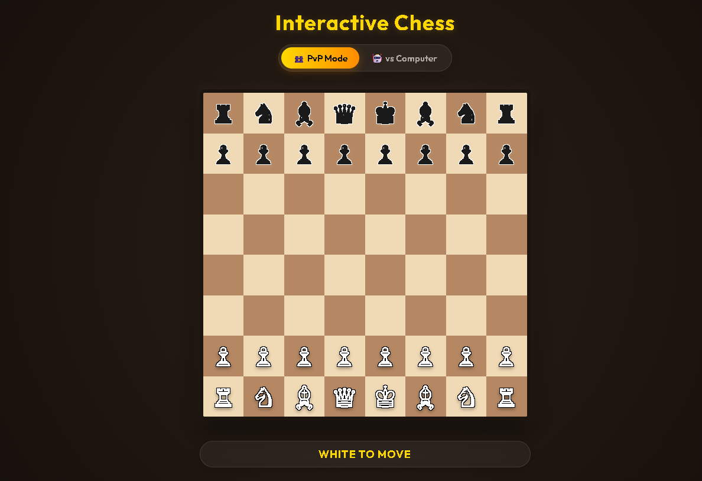

diff --git a/README.md b/README.md
index 628a470..76c7a94 100644
--- a/README.md
+++ b/README.md
@@ -49,7 +49,7 @@ Chessboard/
 1. Download or clone this repository.
 
 ```bash
-git clone https://github.com/rajan9430/Chassboard.git
+git clone https://github.com/Heytiwari/Chessboard.git
 ```
 
 2. Open the project folder.
@@ -87,19 +87,8 @@ No installation or additional libraries are required.
 
 ## 📸 Screenshot
 
-Add your project screenshot here.
+
 
-```
-images/screenshot.png
-```
-
-Example:
-
-```md
-
-```
-
----
 
 ## 🔮 Future Improvements
 
